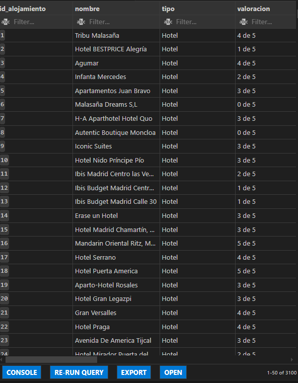
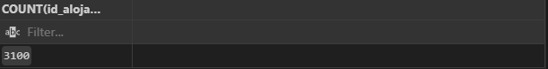
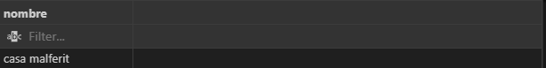
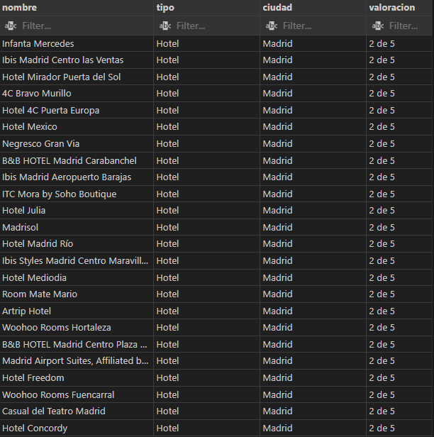

--------------------------------------------------------------------------------------------------------------------------------
                                                    PROYECTO- EDA / ETL
--------------------------------------------------------------------------------------------------------------------------------

AUTOR DEL PROYECTO
Aarón Martínez Dumont

--------------------------------------------------------------------------------------------------------------------------------

DESCRIPCIÓN DEL PROYECTO
Este proyecto tiene como objetivo extraer, procesar y visualizar datos de alojamientos turísticos en diferentes 
ciudades de España. Los datos se obtienen de la web de Booking.com, se procesan y almacenan en una base de datos 
SQLite, y finalmente se visualizan en Power BI.

--------------------------------------------------------------------------------------------------------------------------------

ESTRUCTURA DEL PROYECTO
1. Extracción de Datos:
    -Se utiliza Selenium para navegar y extraer información de Booking.com.
    -Los datos extraídos incluyen: nombre del alojamiento, tipo, valoración, 
        localización, ciudad, distancia, cercanías y descripción.

2. Procesamiento de Datos:
    -Los datos se guardan en un archivo CSV (alojamientos.csv).
    -Se realiza un tratamiento adicional para normalizar ciertos campos, como las valoraciones.

3. Almacenamiento:
    -Los datos se insertan en una base de datos SQLite (Proyecto_Master.sqlite).
    -La base de datos incluye una tabla principal (Alojamientos) para almacenar la información procesada.

4. Visualización:
    -Los datos se visualizan en Power BI, donde se crean gráficos y mapas interactivos para analizar la información.

--------------------------------------------------------------------------------------------------------------------------------
    
REQUISITOS
    -Python 3.8+
    -Librerías necesarias:
        -selenium
        -sqlite3
        -csv
        -os
    -Herramientas adicionales:
        -Chromedriver

--------------------------------------------------------------------------------------------------------------------------------

EJECUCIÓN DEL PROYECTO
1. Configuración inicial:
    -Asegúrate de que el archivo chromedriver.exe esté en la ubicación correcta.
    -Instala las dependencias necesarias: pip install selenium

2. Extracción de datos:
    -Ejecuta el script principal: python "Proyecto 1.0.0.py"

3. Procesamiento del CSV:
    El archivo alojamientos.csv se genera automáticamente.
    Se trata el campo de valoraciones utilizando la función modificar_campo_csv.

4. Carga en la base de datos:
    -De no estar creada, ejecuta el script: base de datos.sql
    -Los datos se insertan en la base de datos SQLite ejecutando el script: inserciones_badd.py

5. Visualización:
    -El archivo descripcion.sql permite visualizar los datos insertados de manera básica.
    -Abre el archivo Power BI (visualizacion.pbix) para explorar los datos.

--------------------------------------------------------------------------------------------------------------------------------

ESTRUCTURA DE ARCHIVOS
    -Proyecto 1.0.0.py: Script principal para la extracción y procesamiento de datos.
    -Funciones_Proyecto.py: Contiene funciones auxiliares como la configuración de Selenium y el tratamiento del CSV.
    -base_de_datos.sql: Script SQL para crear la estructura de la base de datos.
    -inserciones_badd.py: Script para insertar los datos en la base de datos.
    -descripcion.sql: Script para visualizar los datos de la base de datos.
    -alojamientos.csv: Archivo CSV con los datos extraídos.
    -alojamientos_modificado.csv: CSV procesado con los datos normalizados.
    -Proyecto_Master.sqlite: Base de datos SQLite con los datos almacenados.
    -Proyecto_Master.pbix: Archivo de Power BI para la visualización de los datos.

--------------------------------------------------------------------------------------------------------------------------------

VISUALIZACIONES 

En SQLite
    -Ejecutando el script: descripcion.sql
    
    
    
    

En Power BI
    -Preguntas y respuestas: Potenciado por IA para responder las preguntas de los nuevos usuarios.
    -Matriz de datos: Seguimiento de la media de las valoraciones y los alojamientos.
    -Elementos influyentes clave: Características que influyen en las valoraciones de los alojamientos.
    -Mapa interactivo: Ubicación de los alojamientos por ciudad.
    .
    .
    .
    .

--------------------------------------------------------------------------------------------------------------------------------

PREGUNTAS Y CONCLUSIONES
Preguntas:
    -¿Qué factores parecen influir negativamente en las valoraciones de los alojamientos?
    -¿Qué factores parecen influir positivamente en las valoraciones de los alojamientos?
    -¿Dónde podemos encontrar más competición?
    -¿Cuál es la media de España en valoraciones?
    -¿Podríamos saber qué ciudades tienen más turismo o son más grandes?

Respuestas:
    -Si es un albergue, hostal y está cerca del centro.
    -Si es hotel, si se encuentra en el Rincón de Loix o Benidorm, está cerca del centro, de Benidorm o Bilbao.
    -En las ciudades de Madrid y Barcelona es donde más competición hay.
    -2,43 parece ser la media de España entre los diferentes alojamientos.
    -Probablemente Madrid y Barcelona al tener mayor competición, sean más grandes y haya más turismo.

--------------------------------------------------------------------------------------------------------------------------------

PROBLEMAS ENCONTRADOS Y SOLUCIONES
1. Problema con caracteres especiales en el CSV:
    Solución: Uso de parámetros en las consultas SQL para evitar errores con comillas simples.

2. Errores en la conexión a SQLite:
    -Solución: Verificar que el archivo de la base de datos esté en la ubicación correcta y no esté bloqueado por otro proceso.

3. Rendimiento en la extracción de datos:
    -Solución: Implementación de un sistema para cargar más resultados automáticamente en Booking.com.

4. Problemas de la visualización del mapa interactivo en Power Bi:
    -Solución: Habilitar los objetos y mapa interactivo, después reiniciar Power Bi.

--------------------------------------------------------------------------------------------------------------------------------

CONTRIBUCIONES
Si deseas contribuir a este proyecto, puedes enviar un pull request o reportar problemas en el repositorio de GitHub.

--------------------------------------------------------------------------------------------------------------------------------

LICENCIA
Este proyecto está bajo la licencia MIT. Puedes usarlo, modificarlo y distribuirlo libremente.

--------------------------------------------------------------------------------------------------------------------------------
